# project 业务逻辑

# 新建项目

## 有人发布项目的时候，如果是一度(直接好友)好友二度好友，那就可以在机会中看到

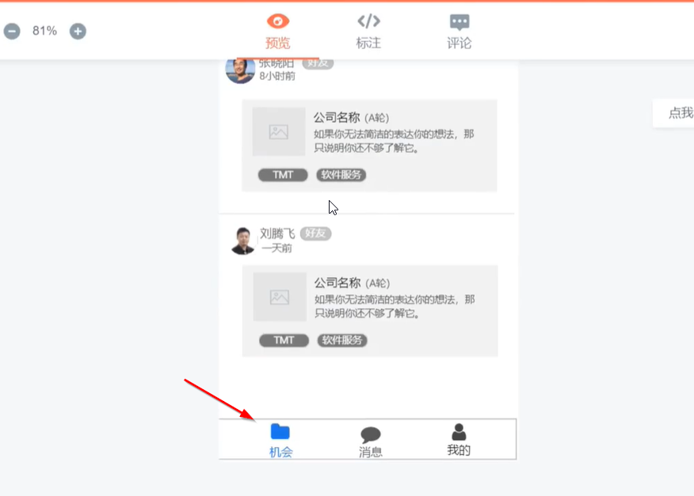

## 新建项目

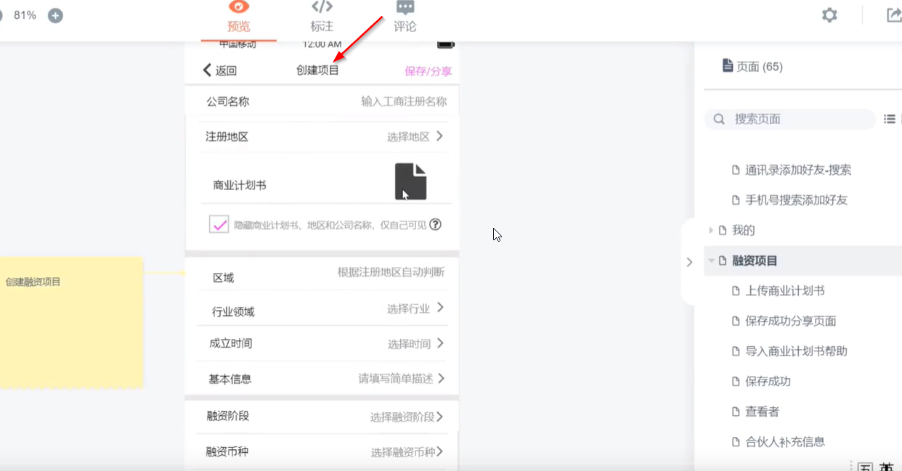

## 委托给平台

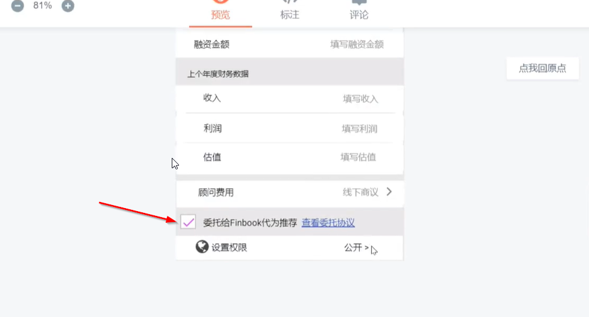
创建项目委托给平台以及设置权限
如果是公开就会推荐给二度好友

## 设定权限

委托给平台，意思是推荐给平台的所有人，即使没有好友关系

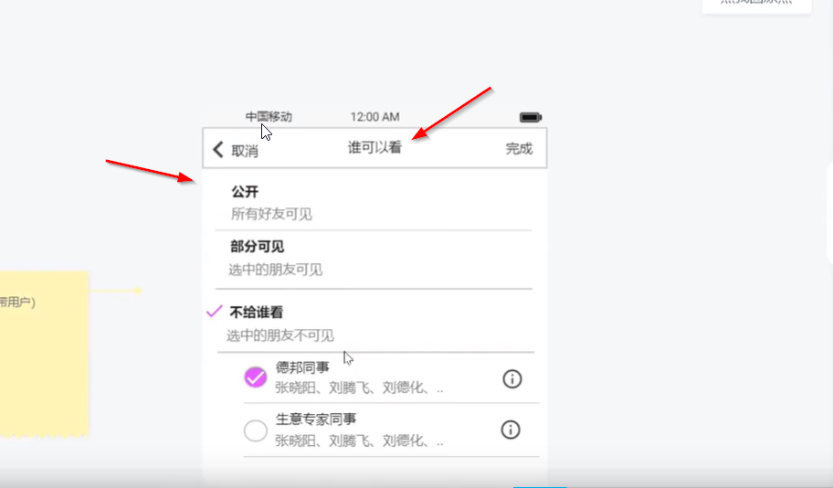

当新建一个项目的时候可以设定权限，谁可以看

# 我的

项目新建完之后就会进入我的

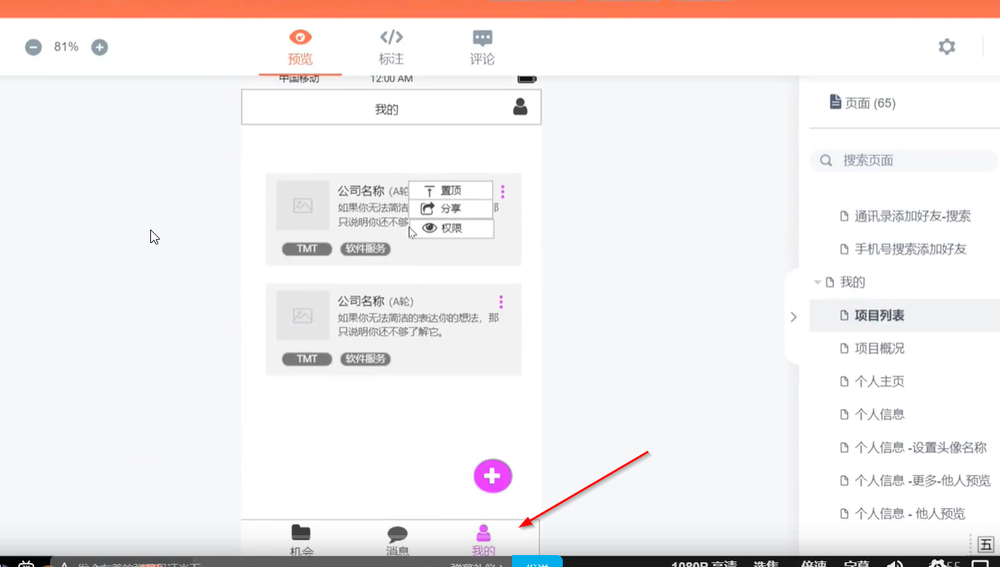

## 可以置顶，分享，权限

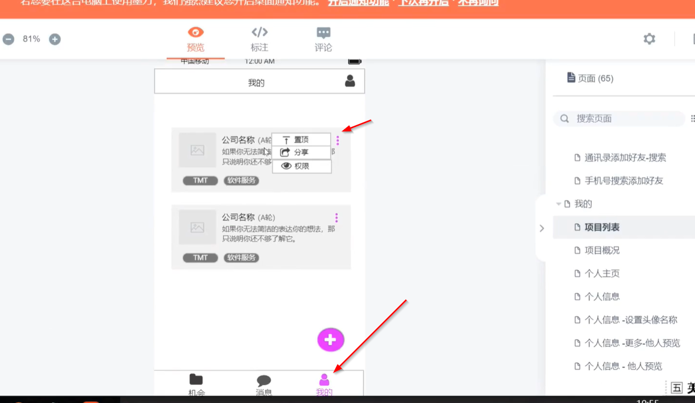

# 其他人机会中可以查看项目

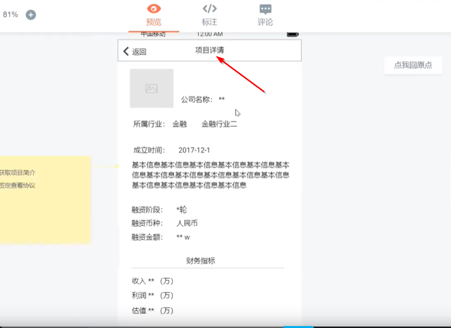
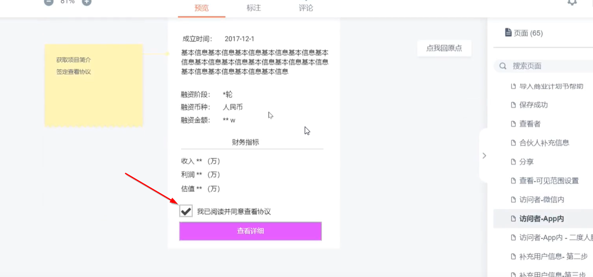

## 得同意协议才可以查看详细

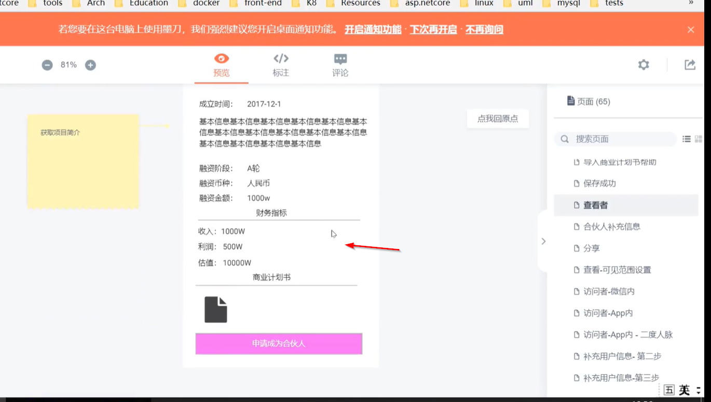
项目创建人会收到一条消息，有人查看了你的项目

## 可以申请加如项目

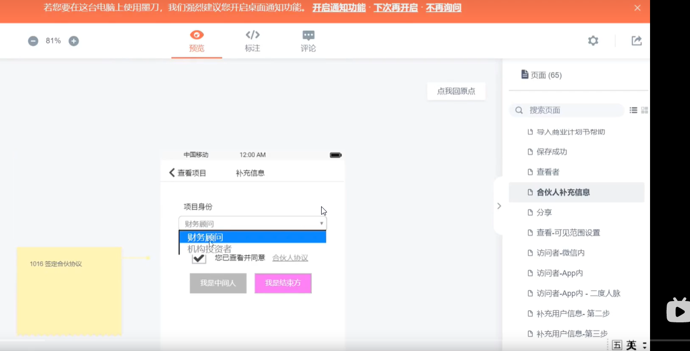
告诉是中间方，还是结束方

## 会进入到我的中，这个项目就你的朋友能看到，我的朋友也能看到，类似微信朋友圈转发功能

此时项目发起人就会收到，有人查看和有人加入这个项目

## 其实已经加入了，项目创建人可以选择点对号，就会创建群了

如果我是申请加入并且选择了结束方，
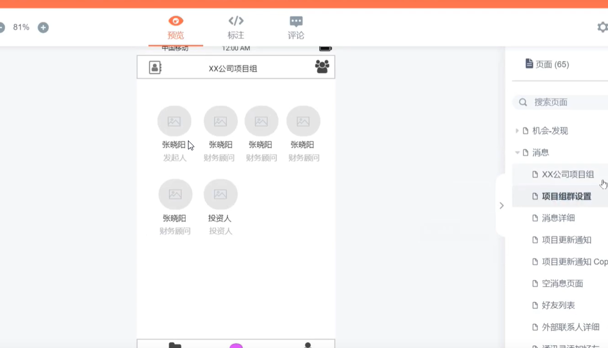
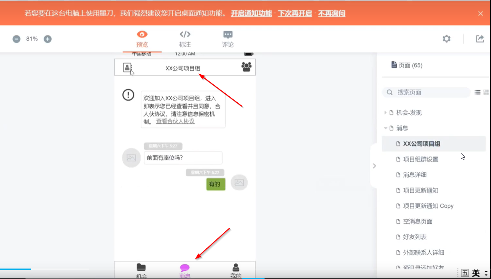

有可能会产生多个链条
